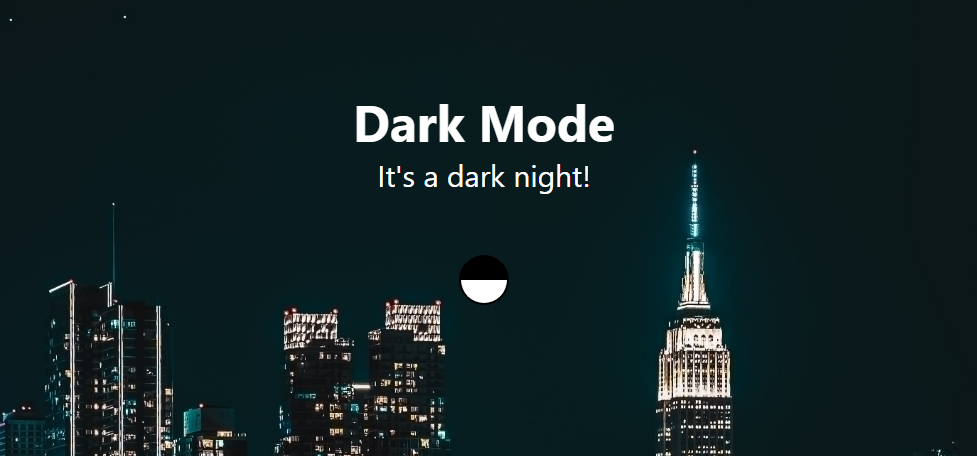

# Dark Mode



[Demo Website](https://reuelo.github.io/dark-mode/)

This is a basic website (built using HTML, CSS and jQuery) for switching or toggling themes.

This project is inspired by John Smilga's "Javascript Basic Projects":

```https://github.com/john-smilga/javascript-basic-projects.```

The background images are the astounding benefit of "Pexels": 

[Day Background](https://www.pexels.com/photo/white-cloud-in-the-sky-1586981/)

[Night Background](https://www.pexels.com/photo/skyline-photography-of-buildings-3052361/)
